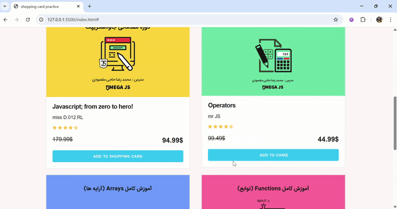

# 🛒 Simple Shopping Card with Vanilla JS

Hi! This is a **practice project** I made while learning JavaScript.  
It’s a basic **shopping card** (like adding courses to a basket) using only **Vanilla JavaScript**, **HTML**, and a bit of **CSS**.  
I used this project to practice DOM manipulation, event listeners, and working with Local Storage.
The source of this HTML & CSS is belongs to other site, I manipulated some parts of it.

---

## 💡 What I Learned

- How to add and remove items from the card (shopping basket).
- How to store data in Local Storage so it stays after refreshing the page.
- How to update the page dynamically using JavaScript.
- Also tried to fix some bugs like removing only **one instance of a course**, not all of them.

---

## ⚙️ Features

- Add courses to the shopping card.
- Remove **one course at a time**.
- Remove all courses at once.
- The courses stay in the card even after refreshing the page (thanks to Local Storage).

---

## 🔧 Tools I used

- HTML5
- CSS3
- JavaScript (Vanilla, no libraries)

---

##🚀 Next steps (maybe later)

- Try to make it using **OOP (Object Oriented Programming)**.
- Add quantity counters and prices calculator.
- Make it look nicer with better CSS.
- Try to use a framework (like React) to see the difference.

  ## Demo

Here is a quick demo of how the shopping card works:

